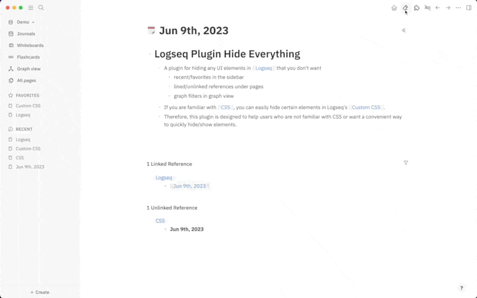

# Logseq Plugin Hide Everything

A plugin for hiding any UI elements in Logseq that you don't want.

If you are familiar with CSS, you can easily hide certain elements in Logseq's Custom CSS. Therefore, this plugin is designed to help users who are not familiar with CSS or want a convenient way to quickly hide/show elements.

> If my plugin has solved your problem and you would like to show your appreciation, you can choose to support me by [buy me a coffee](https://www.buymeacoffee.com/yuexunjiang).

## Install

### Option 1: directly install via Marketplace

### Option 2: manually load

- turn on Logseq developer mode
- [download the prebuilt package here](https://github.com/ahonn/logseq-plugin-hide-everything/releases)
- unzip the zip file and load from Logseq plugins page

## Contribution
Issues and PRs are welcome!

## Licence
MIT
